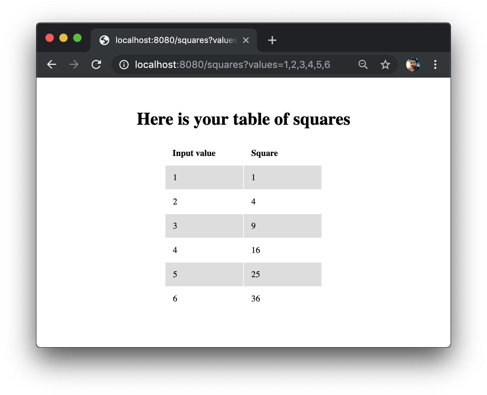

# A toy example using both aiohttp client/server

The [API wrapper][API wrapper] make use of the asynctools helpers,
the [server][server] simply serve a web interface for the wrapper.
The server will render a [jinja2 template][squqare template] showing a table of squares.

Running this example: 

```console
$ python example/maths_server.py

Server ready, try it: http://localhost:8080/squares?values=1,2,3,4,5,6,7,8,9,10
======== Running on http://0.0.0.0:8080 ========
(Press CTRL+C to quit)
```

Which should render the following: 




[API wrapper]: maths_wrapper.py
[server]: maths_server.py
[squqare template]: templates/squares.jinja2
